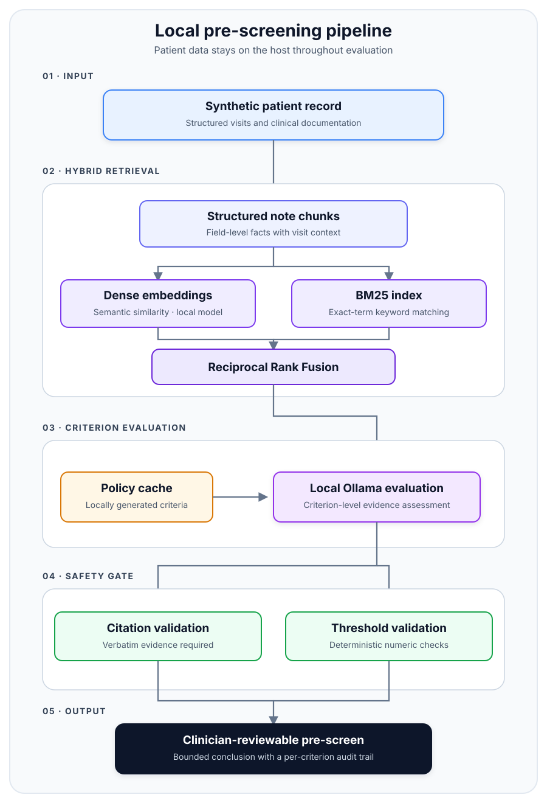

# BC Special Authority Pre-Screen

A local-first research prototype that compares synthetic clinical documentation with
BC PharmaCare Special Authority criteria and produces an evidence-linked pre-screen.

> **Research use only.** This project does not determine coverage, provide medical
> advice, or replace a prescriber, pharmacist, or PharmaCare adjudicator.

## Problem

Special Authority requests require clinicians to find and document drug-specific
coverage evidence. This prototype makes that review easier to audit: every result is
broken down by criterion, supported by a direct quotation when evidence is found, and
paired with documentation guidance when evidence is absent or unclear.

## Design decisions

- **Local inference:** prompts are restricted to an Ollama instance on loopback.
- **No patient database:** dense vectors and BM25 indexes live in process memory.
- **Hybrid retrieval:** semantic and keyword results are combined with Reciprocal Rank Fusion.
- **Evidence enforcement:** a `MET` result requires a verbatim quotation from retrieved notes.
- **Conservative numeric checks:** simple thresholds are checked with deterministic Python math;
  ambiguous cases receive a separate local-model verification.
- **Privacy-safe repository:** only synthetic demonstration records are included.
- **Bounded conclusions:** results say “potentially eligible,” “manual review required,” or
  “documentation gaps found”—never that coverage is guaranteed.

## Architecture

<p align="center">
  
</p>

The web server binds to `127.0.0.1`. The runtime has no cloud API integration,
telemetry, external fonts, or browser persistence. See [Privacy](docs/PRIVACY.md)
and [Architecture](docs/ARCHITECTURE.md).

## Quick start

Requirements: Python 3.11+, [Ollama](https://ollama.com/), and enough memory to run
`llama3.1:8b` locally.

```bash
python3 -m venv .venv
source .venv/bin/activate
python -m pip install -r requirements.txt
ollama pull llama3.1:8b
python run_local.py
```

Open `http://127.0.0.1:8000`.

The first installation and model/embedding download require internet access. After
the dependencies and models are cached, eligibility checks run locally.

## Updating policy material

Network access is isolated to an explicit maintenance command:

```bash
python scrape_sa_policies.py --allow-network
python check.py --ingest
```

The public demo uses fictional criteria. A locally generated real-policy cache can
still become stale, so always verify it against the current official [BC PharmaCare
Special Authority drug list](https://www2.gov.bc.ca/gov/content/health/practitioner-professional-resources/pharmacare/programs/special-authority/sa-drug-list)
before relying on a result.

## Command line

```bash
python check.py --list
python check.py --demo
python check.py DEMO-001 "demo migraine preventive"
```

## Tests

```bash
python -m pip install -r requirements-dev.txt
make check
```

The unit tests cover deterministic safety helpers and patient-note assembly. A
clinician-reviewed validation set is still required before any real-world pilot.
See [Validation](docs/VALIDATION.md).

## Repository data

- `data/demo_patients.json` contains 48 explicitly synthetic demonstration records.
- `data/demo_criteria_cache.json` contains fictional criteria for the public demo.
- Real policy pages and their generated cache stay under ignored `.local/` paths.
- Raw downloaded policy pages are intentionally excluded from Git and must not be
  redistributed without confirming permission.
- Real patient records must never be committed to this repository.

See [Data sources and attribution](docs/DATA_SOURCES.md).

## Important limitations

- Policy extraction can flatten complicated AND/OR, renewal, or indication-specific logic.
- Local LLM output can still be wrong even when fluent.
- A retrieved citation proves textual support, not clinical correctness or eligibility.
- Criteria change over time, and a locally generated snapshot may become stale.
- This repository has not undergone regulatory, security, or clinical validation.

## Project status

Engineering portfolio project and research prototype. Current development priorities
are policy versioning, explicit Boolean criterion representation, and a
clinician-reviewed evaluation set.

This project is independent and is not affiliated with or endorsed by the Government
of British Columbia or BC PharmaCare.

No open-source licence has been selected yet. Until one is added, normal copyright
rules apply to the project code.
